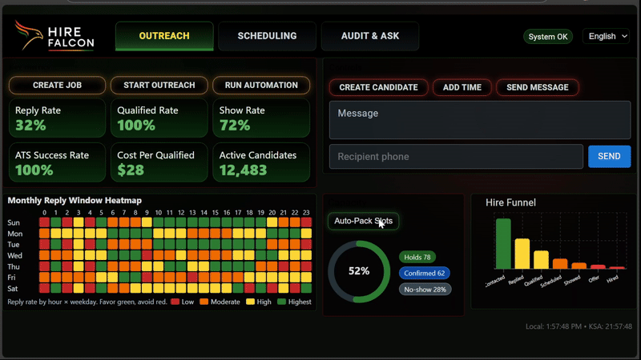
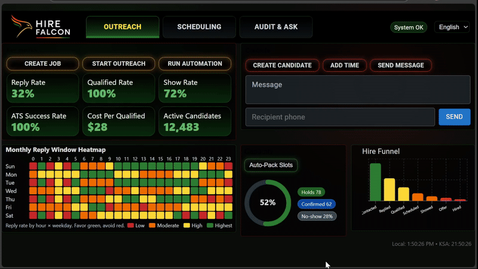
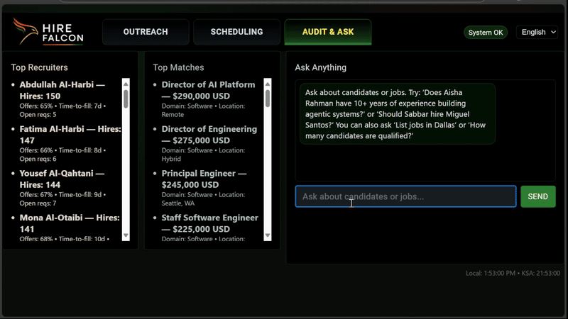
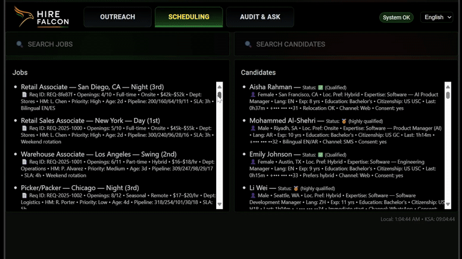
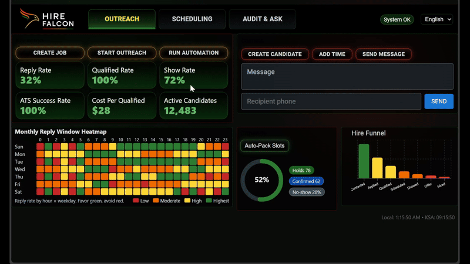

 # Agentic AI Recruiter

Production‑minded agentic AI recruiter for high‑volume hiring. It contacts candidates (SMS/WhatsApp/web), captures consent, screens with knockout rules, schedules interviews, writes to the ATS, and updates a live dashboard with KPIs and a signed, append‑only audit trail.

## UI Overview

### Outreach (Tab 1)
This clip shows the Outreach console in action: composing and sending messages (SMS/WhatsApp/web), watching KPIs update live, and scanning the funnel. The language selector in the top‑right can switch the entire UI (all tabs) between English, Arabic, and Chinese.

Backend agents powering this flow:
- Messaging Agent: sends/receives across channels (can be wired to social messaging providers).
- Screening Agent: captures consent and handles knockout questions.
- Scheduler Agent: proposes/updates interview slots.
- ATS Sync Agent: writes outcomes back to the ATS.
- Compliance/Policy Agent: enforces guardrails (allowed channels, redactions, limits).

What you’ll see: KPI tiles (reply/qualified/show/ATS success, cost per qualified, active candidates) and a real‑time funnel (Contacted → Replied → Qualified → Scheduled → Showed → Offer → Hired).



Below: the same screen after triggering outreach and automation; tiles and the funnel animate as new events arrive.

### Scheduling (Tab 2)
This clip shows the Scheduling experience. You can view, search, and select jobs; click a job to view more detail. Search supports free‑text on any job field (pay rate/salary, title, location, onsite/hybrid/remote, etc.). Candidate profiles include preferences (onsite/remote), pay range, role, and experience, enabling side‑by‑side matching. Both Jobs and Candidates have their own search bars, so you can filter each list independently to align on like‑criteria.



Below: the filtered job and candidate results appear side‑by‑side for quick matching.

### Audit & Ask (Tab 3)
This clip shows the Audit & Ask screen. At a glance, you can see top recruiters and recent top matches. The Ask panel (ChatGPT‑connected) lets you ask natural‑language questions about jobs, candidates, or providers and get readable, paragraph‑style answers.



Below: the replayable audit and policy context make it easy to inspect decisions and outcomes.

### Candidate Journey (from Scheduling)
This clip shows how selecting a job or candidate reveals a context‑aware View button. Clicking View Candidate opens the Candidate Journey: a full‑screen view with a timeline from Outreach → Reply/Consent → Qualification → Scheduling → ATS Update → Hired, an interactive activity calendar and legend, the candidate’s header details, and a notes panel. Use the green right‑arrow SCHEDULE button (top‑right) to jump back to scheduling with the candidate pre‑selected; the outlined BACK arrow returns to the previous tab.



Below: the journey view reflects the candidate you selected and keeps a clean, consistent layout.

### Arabic (AR, RTL)
This clip shows selecting Arabic from the language dropdown and navigating the whole app fully localized, including list values and calendar month/day names. The UI switches to RTL layout.



Below: Outreach, Scheduling, Candidate Journey, and Audit & Ask all render in Arabic.

### Chinese (ZH)
This clip shows selecting Chinese (Mandarin) and navigating the app with localized headings, list values, timeline event titles/summaries, note text, and calendar month/day names.


Below: the same flows as English/Arabic, fully localized for Chinese.

## End‑to‑End Recruiter Flow (Demo)

1) Create a job, start outreach, and run automation
   - Click "Create Job" → "Start Outreach" → "Run Automation" on the Outreach tab.
   - Watch KPI tiles update and the Funnel populate (Contacted → Replied → Qualified → Scheduled).

2) Scheduling and Candidate Journey
   - Go to the Scheduling tab, search/filter as needed.
   - Click a candidate to highlight, then click "View Candidate" to open the Candidate Journey.
   - The Candidate Journey shows:
     - Timeline of key events (Outreach → Reply/Consent → Qualification → Scheduling → ATS Update → Hired)
     - Interactive month calendar with color‑coded activity and a fixed legend
     - Recruiter notes with a notes input field and an Add button
   - Use the arrow‑shaped BACK/SCHEDULE buttons to return to Scheduling or deep‑link to the scheduling flow.

3) Audit & Ask
   - Open the Audit & Ask tab to see the signed audit trail, use Replay, and ask questions in the Ask panel.

4) Multi‑language (EN/AR/ZH)
   - Use the top‑right locale selector. All headings, labels, list values, and the Candidate Journey (timeline, summaries, notes) translate.
   - Arabic uses RTL; Chinese uses localized month/day names in the calendar.

## Quick Start

### Docker (fastest)
```bash
cp .env.example .env
docker compose up --build
```
Services:
- Orchestrator http://localhost:8000
- ATS service http://localhost:8001
- Dashboard http://localhost:5173

### Local development
Terminal A
```bash
cd apps/orchestrator
pip install -r requirements.txt
uvicorn main:app --reload --port 8000
```
Terminal B
```bash
cd apps/ats-mock
pip install -r requirements.txt
uvicorn main:app --reload --port 8001
```
Terminal C
```bash
cd apps/dashboard
npm i
npm run dev
```

### Configuration
Copy `.env.example` to `.env` and set values.
```
MODE=demo
VITE_API_BASE=http://localhost:8000
ATS_BASE=http://localhost:8001
ATS_CONNECTOR_BASE=
CHANNEL_CONNECTOR_BASE=
SIGNING_SECRET=dev-signing-secret
VITE_REQUIRE_AUTH=false
VITE_AUTH0_DOMAIN=
VITE_AUTH0_CLIENT_ID=
VITE_AUTH0_AUDIENCE=
VITE_SENTRY_DSN=
SENTRY_DSN=

# Optional real adapters
TWILIO_ACCOUNT_SID=
TWILIO_AUTH_TOKEN=
TWILIO_SMS_NUMBER=
GREENHOUSE_API_TOKEN=
LEVER_API_TOKEN=
WORKDAY_BASE_URL=
```

## Architecture

```
/apps
  /orchestrator       # FastAPI: agent runtime, audit, KPIs, SSE, scheduling, policy
  /ats-mock           # Minimal ATS service used in local runs
  /ats-connector      # ATS connector skeleton
  /channel-connector  # Channel connector skeleton
  /dashboard          # Main React + Vite UI (auth-capable)
  /dashboard-demo     # Additional UI
/packages
  /policies           # YAML guardrails
  /common             # shared types
  /testing            # pytest config/tests
/infra
  docker-compose.yml
.env.example
```

- Runtime: Python 3.11+, FastAPI, Uvicorn
- Frontend: React + Vite + Material UI
- State: In-memory for demo; SQLite/Postgres-ready seams
- Events: Server-Sent Events (SSE) to push live updates
- Modes: MODE=demo (local) or MODE=real (adapters)

## Product One‑Pager (Executive Summary)
- What it is: A production-grade, multi-agent recruiter that is governed and measurable.
- What it does: Outreach, consent, screening, document capture, scheduling, ATS sync, real-time KPIs, and a replayable audit trail.
- Why it’s different: Multi-agent flow, explicit policy guardrails, append-only hash chain, Hiring Simulator, bilingual-ready UI.
- How it ships: Orchestrator + connectors, polished UI, Docker‑ready.

## API Reference (Backend)

Health
- GET `/health` → { ok, mode }

Jobs & Candidates
- POST `/jobs` body: { title, location, shift, reqs[] }
- GET `/jobs`
- POST `/candidates` body: { name, phone, locale?, consent?, status? }
- GET `/candidates`

Outreach & Flow
- POST `/simulate/outreach?job_id=...` (alias: POST `/outreach/start`)
- POST `/simulate/flow?job_id=...&fast=true`

Scheduling
- POST `/schedule/propose?candidate_id=...`
- POST `/schedule/confirm?candidate_id=...`

Audit & Events
- GET `/audit?limit=250&cursor=` → { events[], next_cursor }
- GET `/audit/verify` → { ok, broken_at? }
- GET `/events/stream` (SSE, event: "audit")

Analytics
- GET `/analytics/top-recruiters` → { items[] } (hires, offer_rate, time_to_fill_days, open_reqs)
- GET `/analytics/top-matches` → { items[] } (title, pay, currency, loc, tag)

Chat (Agent)
- POST `/chat/stream` (SSE)
  - body: { messages: [{ role, content }...], session_id?, include_context? }
  - stream events: `event: chat` `data: <token>`; end with `event: done`

Metrics & Simulator
- GET `/kpi` → tiles
- GET `/funnel` → { contacted, replied, qualified, scheduled, showed }
- POST `/simulate/hiring` query/body: { vol_per_day, reply_rate, qual_rate, show_rate, interviewer_capacity }

Channels & Ops
- POST `/send` body: { to, body, locale, channel } → emits `message.sent` with policy checks
- POST `/channels/inbound` (Twilio-like) → handles consent; logs inbound
- POST `/ops/force` body: { action: schedule_propose|schedule_confirm|ats_resync, candidate_id }

Policy
- GET `/policy` → current policy loaded from `packages/policies/policy.yaml`

## UI Tour
- KPI Overview: live tiles; auto-refresh via SSE.
- Funnel: Contacted → Replied → Qualified → Scheduled → Showed.
- Audit Explorer: latest 250, signed hash on hover; compliance badge; Replay modal to step through events.
- Hiring Simulator: inputs (volume, reply, qual, show, capacity) and outputs (hires/week, scheduled, shows).
- Ops Console: send messages; force propose/confirm; ATS re-sync; see instant updates.
- Jobs & Candidates: simple lists with status and quick scanning.
- Timezone Footer: local and KSA times rendered together.
- Dark Mode + Policy Dialog: quick toggle and governance visibility.

## Implementation Notes
Agents (hand-rolled orchestrations, swappable to LangGraph later):
- Planner (implicit via orchestrated endpoints), Sourcing, Screening, Scheduling, Compliance (policy checks), QA/Eval (tags outcomes), Data Agent (ATS writeback).

Policy & Governance:
- `packages/policies/policy.yaml` defines allowed_channels, max_questions, redactions, language. Loaded at runtime.
- Every outbound message includes a `compliance` section; all audit events are chained: `sha256(ts + payload_sorted + prev_hash + SIGNING_SECRET)`.
- `/audit/verify` validates the chain end-to-end.

Scheduling:
- Greedy slot proposal and confirmation; utilization surfaced via the simulator (hires/week approximation).

Connectors:
- `apps/ats-connector`, `apps/channel-connector` provide connector stubs.
- Orchestrator can write to an ATS service in local runs.

Events:
- SSE endpoint streams `audit` events that the UI consumes for near-real-time updates.

## Test Plan & Acceptance Criteria
Unit
- Policy loader and compliance checks.
- Hash chaining and verification logic.
- Simulator math.

Integration
- ATS application creation path.
- Channel inbound consent handling updates candidate state and audit.

E2E
- Create Job → Simulate Outreach → Run Flow → KPI tiles update → ATS application exists → Audit shows signed events → Replay works.

Definition of Done
- Full‑path happy flow validated end‑to‑end; real mode ready to swap connectors.
- Dashboard is business-presentable (dark mode, policy visibility, badges, toasts).
- Audit chain verifies; `/policy` endpoint reflects configured rules.
- README includes Quick Start, Demo Script, Architecture, One-Pager, API Reference, UI tour, and Test Plan.

## License
MIT. Replace organization identifiers before sharing externally.

## One-command Demo (CLI)
With the orchestrator running on http://localhost:8000:
```bash
python scripts/demo_walkthrough.py
```
This will: create a job, seed outreach, run the flow, print KPI tiles, and verify the audit hash chain.

## Record a Quick GIF (for stakeholders)
- Start dashboard (http://localhost:5173), open in a clean browser window
- Click: Create Job → Simulate Outreach → Run Flow
- Hover an audit row to show the hash, open Replay, then the Policy dialog
- Run the Hiring Simulator at 500/day and point to hires/week
- Keep the clip under 45 seconds

## Deploy to Render (optional)
This repo includes `render.yaml` for a three‑service deploy (orchestrator, ats service, dashboard).

Steps:
1) Push to GitHub (develop). In Render, "New > Blueprint" and select this repo.
2) First deploy will use placeholder URLs. After it boots:
   - Copy the public URL of the ATS service into the `ATS_BASE` env var of `recruiter-orchestrator`.
   - Copy the public URL of `recruiter-orchestrator` into `VITE_API_BASE` env var of `recruiter-dashboard` and redeploy dashboard.
3) Visit the dashboard app URL and run the same 90-second demo flow.

## Staging Deploy Checklist
- Environment
  - MODE=real (optional) • SIGNING_SECRET set • VITE_REQUIRE_AUTH=true (main UI)
  - VITE_API_BASE points to orchestrator • ATS_BASE/ATS_CONNECTOR_BASE set
  - CHANNEL_CONNECTOR_BASE set if using an outbound provider
  - DATABASE_URL set to Postgres (optional)
  - SENTRY_DSN and VITE_SENTRY_DSN set (optional)
  - Auth0 (optional): VITE_AUTH0_DOMAIN, VITE_AUTH0_CLIENT_ID, VITE_AUTH0_AUDIENCE
- Orchestrator
  - /health returns ok:true • /ready returns ready:true
  - /metrics scraped (Prometheus) • Logs visible (Sentry if configured)
- Dashboard
  - Auth works if enabled • Locale toggle (EN/AR) visible
  - KPI tiles and audit update live (SSE)
- Demo warm‑up
  - Run scripts/demo_walkthrough.py once • Verify ATS receives applications
